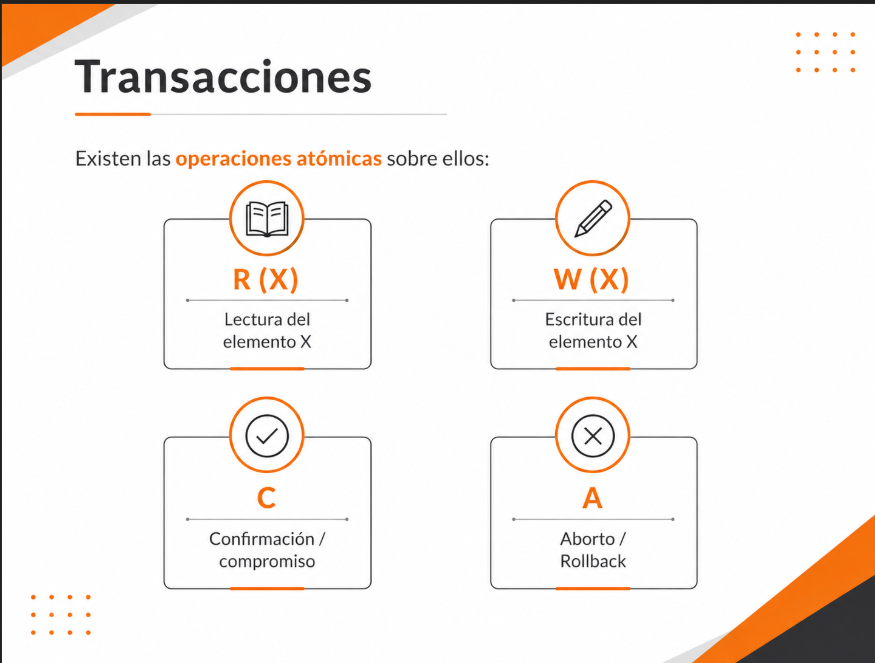
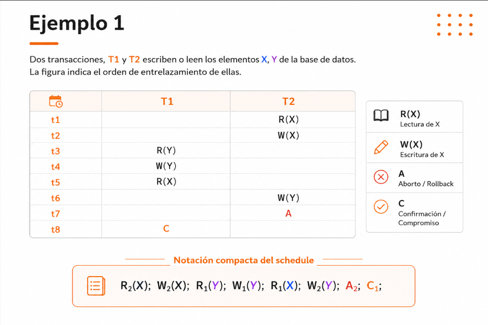

# Understanding Schedules
Toda transacción se construye a partir de un conjunto de operaciones atómicas sobre los datos.



## Ejemplo1



## Note

Aunque en muchos ejemplos una modificación sigue el patrón:

```text
R(X) → calcular → W(X)
```

una operación de escritura `W(X)` **no implica necesariamente** que deba existir una lectura previa `R(X)` sobre el mismo elemento.

Por ejemplo, es válido tener:

```text
W(X)
```

si la transacción simplemente asigna un nuevo valor sin necesitar conocer el anterior.

De la misma manera, también existen transacciones compuestas únicamente por operaciones de lectura:

```text
R(X)
R(Y)
C
```

como ocurre en consultas o generación de reportes.

Por lo tanto, una transacción puede estar formada por:

* Solo lecturas.
* Solo escrituras.
* Una combinación de lecturas y escrituras.

En los ejercicios de concurrencia, las operaciones mostradas representan únicamente los accesos relevantes para analizar el comportamiento del schedule; no necesariamente reflejan todos los pasos internos de una consulta SQL real.

}## Observaciones del Ejemplo 1

Considerando la aclaración anterior, es importante recordar que las operaciones mostradas en el schedule son **atómicas y abstractas**. Aunque aparezcan como una única acción (`R` o `W`), internamente pueden estar compuestas por varias suboperaciones del sistema gestor de bases de datos.

Verificando el comportamiento del Ejemplo 1:

```text
R2(X); W2(X); R1(Y); W1(Y); R1(X); W2(Y); A2; C1;
```

podemos observar lo siguiente:

### 1. El schedule es no serial

Las operaciones de T1 y T2 están entrelazadas.

No ocurre:

```text
T1 completa → T2 completa
```

ni tampoco:

```text
T2 completa → T1 completa.
```

En cambio, ambas transacciones avanzan alternadamente durante la ejecución.

---

### 2. T2 modifica X

```text
R2(X)
W2(X)
```

T2 lee el elemento X y posteriormente escribe un nuevo valor sobre él.

En este caso sí existe el patrón:

```text
R(X) → W(X)
```

aunque dicho patrón no es obligatorio en todos los schedules.

---

### 3. T1 modifica Y

```text
R1(Y)
W1(Y)
```

T1 primero obtiene el valor actual de Y y luego lo actualiza.

Nuevamente se observa el patrón clásico de modificación:

```text
leer → calcular → escribir.
```

---

### 4. T1 lee X después de que T2 escribió X

```text
W2(X)
...
R1(X)
```

Por lo tanto, T1 observa el valor de X producido por T2.

Sin embargo, dicho valor aún no ha sido confirmado mediante un `COMMIT`.

---

### 5. T2 escribe Y sin una lectura previa explícita

```text
W2(Y)
```

No aparece una operación:

```text
R2(Y)
```

antes de la escritura.

Esto es válido dentro del modelo de schedules, ya que una escritura no requiere necesariamente una lectura previa del mismo elemento.

---

### 6. T2 aborta

```text
A2
```

La transacción T2 realiza un rollback.

Esto implica que todos los cambios efectuados por T2 deben deshacerse.

Por consiguiente, las modificaciones realizadas por:

```text
W2(X)
W2(Y)
```

no deben permanecer finalmente en la base de datos.

---

### 7. T1 confirma sus cambios

```text
C1
```

La transacción T1 realiza un commit.

Sus modificaciones quedan permanentemente registradas en la base de datos.

---

### Conclusión

Este ejemplo permite apreciar que un schedule representa únicamente el orden lógico de las operaciones relevantes para el análisis de concurrencia. Además, muestra que:

* Las transacciones pueden entrelazarse.
* Una escritura no siempre requiere una lectura previa.
* Una transacción puede abortar después de haber escrito datos.
* Solo las transacciones que ejecutan `COMMIT` garantizan la permanencia de sus cambios.
