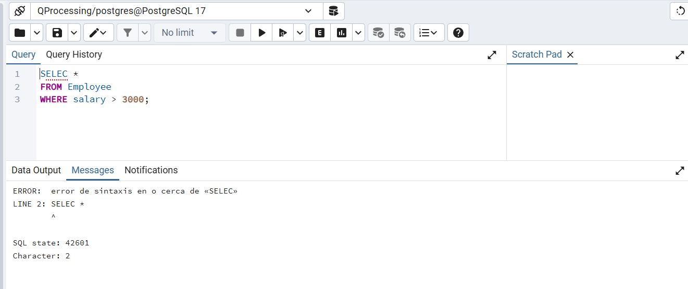
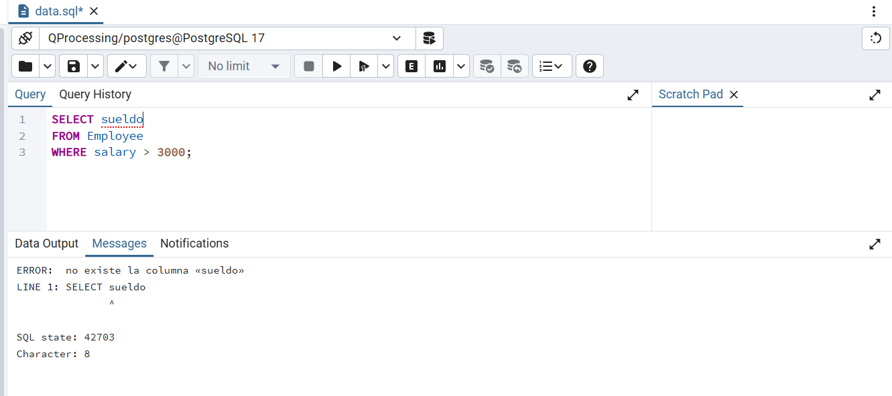
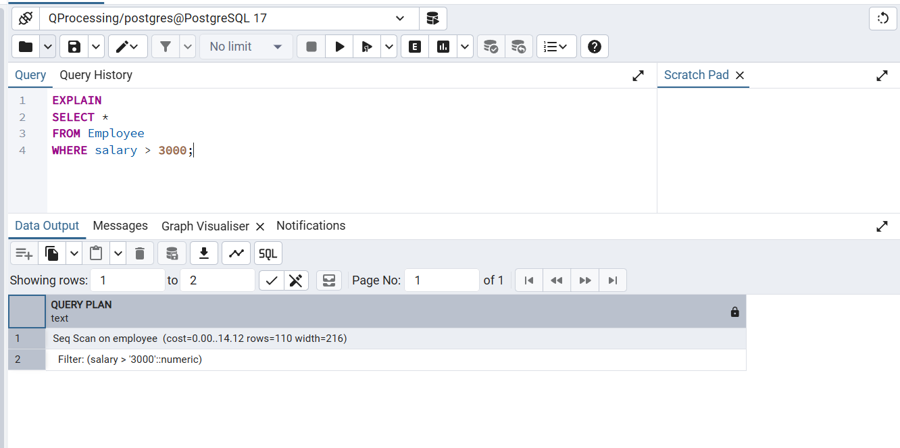
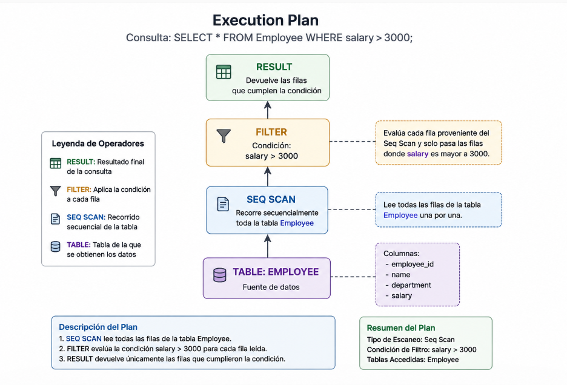
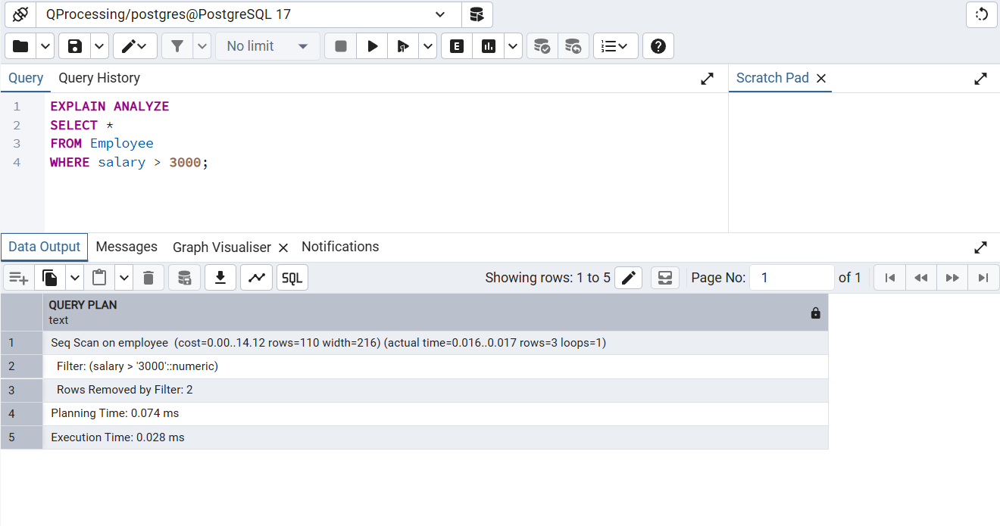

# Query Processing

Proceso mediante el cual un sistema gestor de bases de datos interpreta, transforma y ejecuta una consulta SQL para obtener el resultado solicitado.

## Flujo general:

Tú escribes:

#### SELECT * FROM Employee WHERE salary > 3000;

PostgreSQL internamente hace algo parecido a:

```text
     Usuario
        │
        ▼
Escribe una consulta SQL
        │
        ▼
     Parsing
        │
        ▼
 Semantic Analysis
        │
        ▼
  Query Rewriting
        │
        ▼
  Query Optimization
        │
        ▼
  Execution Plan
        │
        ▼
  Query Execution
        │
        ▼
    Result Set
```

## Implementación en PostgreSQL

Antes de recorrer las etapas del Query Processing, es necesario crear la estructura de la base de datos, cargar datos de prueba y definir las consultas que serán utilizadas durante la demostración.

### Archivos utilizados

| Archivo | Descripción |
|----------|----------|
| [schema.sql](./schema.sql) | Define la estructura de las tablas |
| [data.sql](./data.sql) | Inserta datos de prueba |
| [examples.sql](./examples.sql) | Contiene las consultas utilizadas en los ejemplos |

### Datos de nuestra tabla

| employee_id | name  | department | salary |
|------------|--------|------------|--------|
| 1 | Juan  | Sales | 2500 |
| 2 | Maria | IT    | 4200 |
| 3 | Pedro | IT    | 3800 |
| 4 | Ana   | HR    | 3100 |
| 5 | Luis  | Sales | 2800 |

### Consulta utilizada durante la demostración

```sql
SELECT *
FROM Employee
WHERE salary > 3000;
```

### Resultado esperado

| employee_id | name  | department | salary |
|------------|--------|------------|--------|
| 2 | Maria | IT | 4200 |
| 3 | Pedro | IT | 3800 |
| 4 | Ana | HR | 3100 |

# Paso 1: Parsing

Etapa en la que PostgreSQL analiza la consulta SQL recibida para verificar que cumpla las reglas sintácticas del lenguaje. En este punto únicamente se valida que la consulta esté correctamente escrita; todavía no se comprueba la existencia de tablas, columnas o datos.

Consulta analizada:

```sql
SELECT *
FROM Employee
WHERE salary > 3000;
```

Durante esta etapa PostgreSQL verifica:

- Uso correcto de las palabras reservadas.
- Estructura válida de la consulta.
- Orden correcto de las cláusulas.
- Ausencia de errores de sintaxis.

Representación simplificada:

```text
SELECT
├── *
├── FROM Employee
└── WHERE salary > 3000
```

Prueba realizada:

```sql
SELEC *
FROM Employee;
```

Resultado:

```text
ERROR: syntax error at or near "SELEC"
```

Captura:



Conclusión:

La consulta original supera la etapa de Parsing y puede avanzar a la siguiente fase del Query Processing.


# Paso 2: Semantic Analysis

Etapa en la que PostgreSQL verifica que los objetos utilizados en la consulta existan y puedan ser utilizados correctamente.

Consulta analizada:

```sql
SELECT *
FROM Employee
WHERE salary > 3000;
```

Durante esta etapa PostgreSQL verifica:

- Que la tabla `Employee` exista.
- Que la columna `salary` exista.
- Que los tipos de datos sean compatibles.
- Que el usuario tenga permisos para acceder a los objetos.

Prueba realizada:

```sql
SELECT sueldo
FROM Employee;
```

Resultado:

```text
ERROR: column "sueldo" does not exist
```

Captura:


Conclusión:

PostgreSQL encontró que la columna solicitada no existe y detuvo el procesamiento de la consulta.

# Paso 3: Query Rewriting

Etapa en la que PostgreSQL transforma internamente la consulta para facilitar su procesamiento posterior.

Estas transformaciones pueden incluir:

- Expansión de vistas (Views).
- Aplicación de reglas (Rules).
- Simplificaciones internas.

Consulta analizada:

```sql
SELECT *
FROM Employee
WHERE salary > 3000;
```

En este caso PostgreSQL no necesita realizar modificaciones significativas debido a que la consulta es simple.

Conclusión:

La consulta se mantiene prácticamente igual y es enviada al optimizador.


# Paso 4: Query Optimization

Etapa en la que PostgreSQL analiza diferentes formas de ejecutar la consulta y selecciona la que considera más eficiente según sus estadísticas y costos estimados.

Consulta analizada:

```sql
SELECT *
FROM Employee
WHERE salary > 3000;
```

Prueba realizada:

```sql
EXPLAIN
SELECT *
FROM Employee
WHERE salary > 3000;
```

Resultado obtenido:

```text
Seq Scan on employee
Filter: (salary > 3000)
```

Captura:



### Interpretación

- `Seq Scan` (Sequential Scan) indica que PostgreSQL decidió recorrer la tabla `Employee` de forma secuencial, leyendo cada fila una por una.
- `cost=0.00..14.12` representa el costo estimado por PostgreSQL para ejecutar este plan. No son segundos, sino valores internos utilizados para comparar estrategias de ejecución.
- `rows=110` indica la cantidad estimada de filas que PostgreSQL espera obtener después de aplicar el filtro.
- `width=216` representa el tamaño promedio estimado de cada fila resultante, expresado en bytes.
- `Filter: (salary > 3000::numeric)` muestra la condición que será evaluada sobre cada fila leída.

### ¿Por qué eligió Seq Scan?

La tabla contiene pocos registros, por lo que leer todas las filas resulta más económico que utilizar estructuras adicionales como índices.

### Resultado del análisis

PostgreSQL determinó que la estrategia más eficiente para esta consulta es realizar un recorrido secuencial de la tabla (`Seq Scan`) y aplicar el filtro `salary > 3000` a cada fila encontrada.

### Conclusión

El optimizador generó un plan de ejecución basado en un recorrido secuencial de la tabla, ya que estimó que esta alternativa tiene un costo menor para el escenario actual.


# Paso 5: Execution Plan

Una vez seleccionada la estrategia de menor costo, PostgreSQL genera un plan de ejecución que describe las operaciones que serán realizadas para obtener el resultado solicitado.

Plan generado:

```text
Seq Scan on employee (cost=0.00..14.12 rows=110 width=216)
Filter: (salary > 3000::numeric)
```

Representación simplificada:



Operaciones identificadas:

1. Recorrer la tabla Employee.
2. Leer cada fila de forma secuencial.
3. Aplicar el filtro salary > 3000.
4. Devolver únicamente las filas que cumplan la condición.

Conclusión:

El plan de ejecución indica exactamente qué acciones realizará PostgreSQL durante la ejecución de la consulta.

# Paso 6: Query Execution

Etapa en la que PostgreSQL ejecuta el plan generado por el optimizador y obtiene los datos solicitados por la consulta.

Consulta analizada:

```sql
EXPLAIN ANALYZE
SELECT *
FROM Employee
WHERE salary > 3000;
```

Durante esta etapa PostgreSQL:

- Recorre la tabla Employee.
- Aplica el filtro salary > 3000.
- Descarta las filas que no cumplen la condición.
- Conserva únicamente las filas válidas.
- Mide el tiempo real de ejecución.

Captura:



### Interpretación

PostgreSQL ejecutó un recorrido secuencial (`Seq Scan`) sobre la tabla `Employee`, evaluando la condición `salary > 3000` para cada fila encontrada.

```text
Seq Scan on employee
(cost=0.00..14.12 rows=110 width=216)
(actual time=0.016..0.017 rows=3 loops=1)
```

#### Estimaciones del optimizador

- `cost=0.00..14.12`: costo estimado por PostgreSQL para ejecutar el plan.
- `rows=110`: cantidad estimada de filas que podrían satisfacer la condición.
- `width=216`: tamaño promedio estimado de cada fila en bytes.

#### Resultados reales de la ejecución

- `actual time=0.016..0.017 ms`: tiempo real empleado por el operador.
- `rows=3`: PostgreSQL encontró 3 filas que cumplen la condición.
- `loops=1`: el operador fue ejecutado una sola vez.

#### Filtro aplicado

```text
Filter: (salary > 3000)
```

La condición fue evaluada para cada fila leída de la tabla.

#### Filas descartadas

```text
Rows Removed by Filter: 2
```

De las 5 filas existentes:

| Empleado | Salario | Resultado |
|-----------|----------|-----------|
| Juan | 2500 | Descartado |
| Maria | 4200 | Conservado |
| Pedro | 3800 | Conservado |
| Ana | 3100 | Conservado |
| Luis | 2800 | Descartado |

Por ello PostgreSQL eliminó 2 filas y devolvió 3.

#### Tiempos registrados

- `Planning Time: 0.074 ms`: tiempo utilizado para generar el plan de ejecución.
- `Execution Time: 0.028 ms`: tiempo utilizado para ejecutar el plan y obtener los resultados.

### Resultado del análisis

PostgreSQL recorrió las 5 filas de la tabla `Employee`, descartó 2 registros que no cumplían la condición `salary > 3000` y devolvió 3 filas como resultado final de la consulta.

# Paso 7: Result Set

Etapa final del Query Processing en la que PostgreSQL devuelve al usuario las filas obtenidas durante la ejecución de la consulta.

Consulta ejecutada:

```sql
SELECT *
FROM Employee
WHERE salary > 3000;
```

Resultado obtenido:

| employee_id | name | department | salary |
|------------|--------|------------|--------|
| 2 | Maria | IT | 4200 |
| 3 | Pedro | IT | 3800 |
| 4 | Ana | HR | 3100 |

Interpretación:

- La tabla Employee contiene 5 registros.
- 2 registros fueron descartados por el filtro.
- 3 registros cumplieron la condición salary > 3000.
- Estas filas constituyen el resultado final entregado al usuario.

Conclusión:

El Query Processing finaliza cuando PostgreSQL devuelve el conjunto de resultados solicitado.